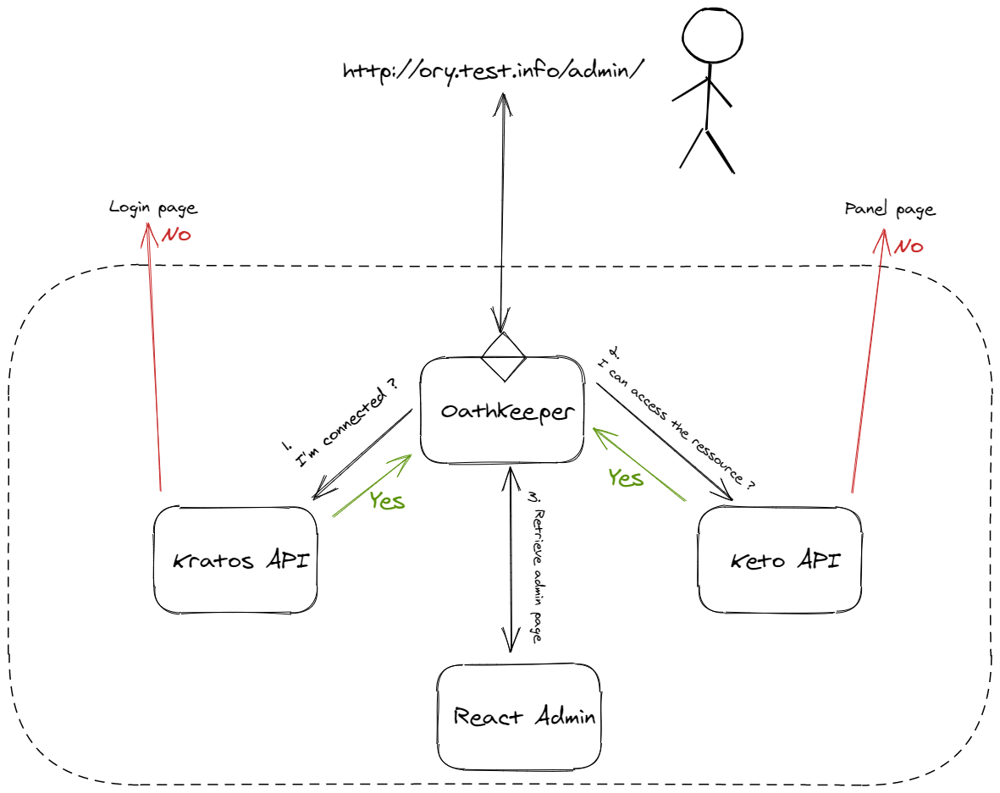

# Ory Kratos, Keto, and Oathkeeper with Kubernetes

This example show how create an SSO and ACL system with the Ory stack and Kubernetes.

Many thanks to [@pngouin](https://github.com/pngouin) for the the [original example](https://github.com/pngouin/k8s-ory-example)
🙌

## Overview

This example uses the [kratos-selfservice-ui-node](https://github.com/ory/kratos-selfservice-ui-node), a fork of
[mailslurper](https://github.com/pngouin/mailslurper) and a [react-admin app](https://github.com/pngouin/react-admin-ory) for the
_admin_ page.

 _(This is an outline and does not exactly reflect the reality of how the stack works)_

## Develop

### Prerequisites

- [minikube](https://minikube.sigs.k8s.io/docs/start/)
- [kustomize](https://kubernetes-sigs.github.io/kustomize/installation/)

### Run locally

```bash
$ minikube start
$ minikube addons enable ingress

# Create all resources
$ ./build.sh | kubectl apply -f -

# waits for Keto to be ready and add policies
$ ./add-keto-policies.sh | kubectl apply -f -
$ kubectl get ingress
NAME               CLASS    HOSTS            ADDRESS        PORTS   AGE
fake-smtp-server   <none>   mail.test.info   192.168.XXX.XXX   80      119s
oathkeeper         <none>   ory.test.info    192.168.XXX.XXX   80      119s

# add ingress to the hosts file
$ sudo bash -c 'cat << EOF >> /etc/hosts
# ORY Minikube SSO stack
192.168.XXX.XXX    mail.test.info
192.168.XXX.XXX    ory.test.info
EOF'

```

Open your browser and navigate to `http://ory.test.info/panel/welcome` and `http://mail.test.info`.

Go to `http://ory.test.info/panel/` and create an account. You can validate your email on http://mail.test.info. When you create
an account you have to add the role `user` or `admin`. Only the admin role has the right to access the admin react app.

| URL                                | Description                                               |
| :--------------------------------- | :-------------------------------------------------------- |
| http://ory.test.info/panel/welcome | User app for create an account, login, other              |
| http://ory.test.info/admin/        | Admin react app, you need the role `admin` to access      |
| http://mail.test.info              | Local mail panel, you will receive mail confirmation here |

## Contribute

Feel free to [open a discussion](https://github.com/ory/examples/discussions/new) to provide feedback or talk about ideas, or
[open an issue](https://github.com/ory/examples/issues/new) if you want to add your example to the repository or encounter a bug.
You can contribute to Ory in many ways, see the [Ory Contributing Guidelines](https://www.ory.sh/docs/ecosystem/contributing) for
more information.
