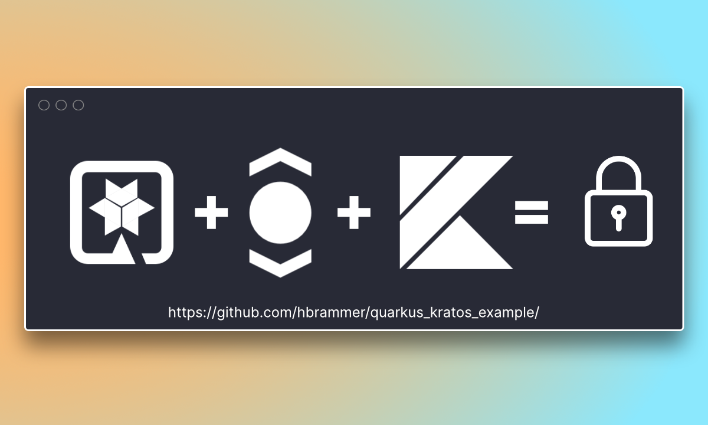

# Secure a Kotlin Quarkus app using Ory Kratos


This repo demonstrates how you can use Ory Kratos to secure a Kotlin Quarkus application.
This app is not for production use and serves as an example of integration.

Read the tutorial on the creator's blog: 
[hauke.me](https://hauke.me/writing/2021-03-building-a-quarkus-application-with-ory-kratos/) 

## Overview
- Creates a simple web page with Quarkus, Kotlin and Qute.
- Secures the web page with Ory Kratos.
- Builds a custom REST client to interact with Kratos.

## Running the application in dev mode

Starting Quarkus:

```shell
./mvnw compile quarkus:dev
```

Starting Kratos:
```shell
docker-compose -f kratos/kratos-quickstart.yml up --build --force-recreate
```

Open http://127.0.0.1:8000 for testing

## Contribute

Feel free to [open a discussion](https://github.com/ory/examples/discussions/new) to provide feedback or talk about ideas, or
[open an issue](https://github.com/ory/examples/issues/new) if you want to add your example to the repository or encounter a bug.
You can contribute to Ory in many ways, see the [Ory Contributing Guidelines](https://www.ory.sh/docs/ecosystem/contributing) for
more information.
