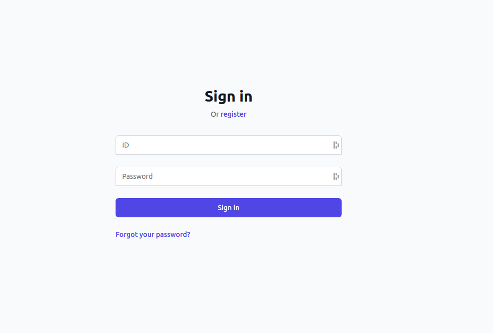
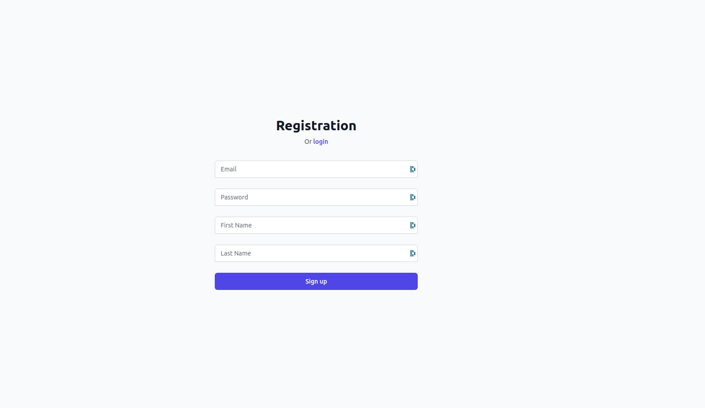
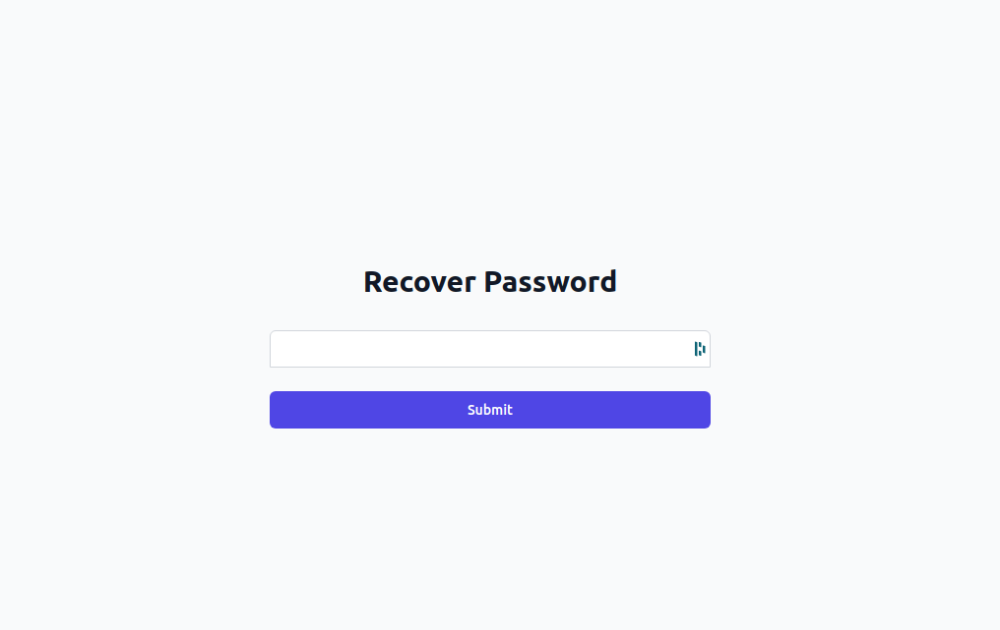
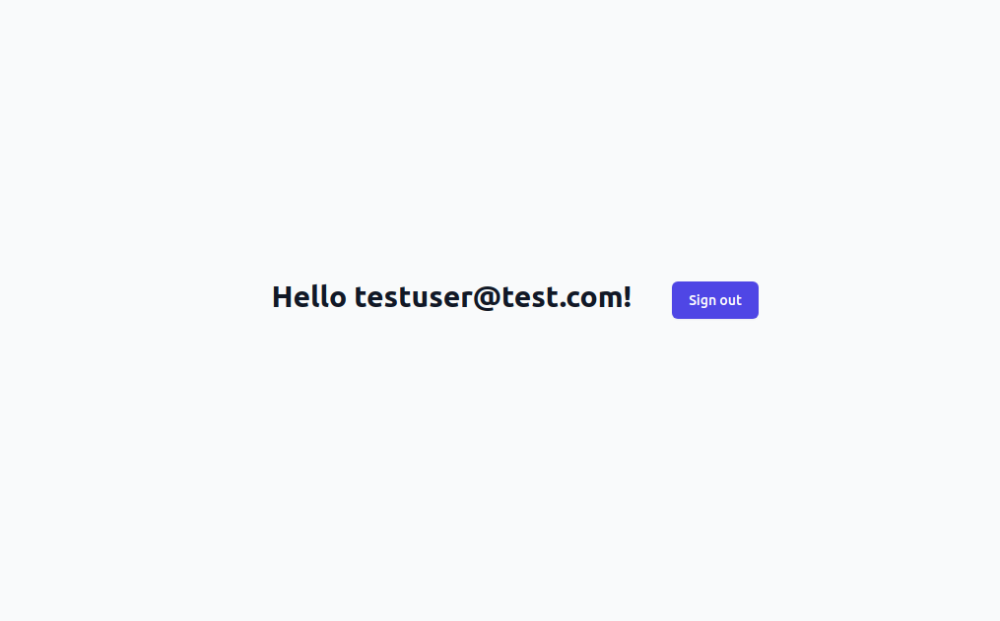

# ReScript React Kratos UI

A SPA (single page application) implementation of the browser-based flows for
[Kratos.](https://github.com/ory/kratos) Currently, the UI implements the login,
logout, registration, and recovery flows. Rather than using redirects, this
implementation leverages Kratos AJAX support to initialize flows.

## Tour

### Login
`/login`


### Registration
`/register`


### Recovery
`/recovery`


### Landing
`/`


### Try it yourself

```sh
# Start backends to run UI against. This includes:
#   * Kratos
#   * Postgres - datastore for Kratos data
#   * Mailslurper - a test email server for routing recovery emails
#
# Optionally add `-d` flag in order to detach and run in the background.
docker-compose -f kratos/docker-compose-backends.yaml up --build --force-recreate

# Terminal 1 start ReScript compiler file watcher
npm run re:start

# Terminal 2 start parcel to bundle and serve UI
npm run serve
```

## Not Implemented

* Admin UI for managing Kratos assets.
* Account management pages for user self-serve account updates.
